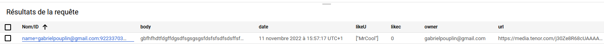
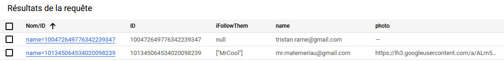

= PROJET TINYGRAM

== Membres

Membres du groupe : 
    - Mathis EMERIAU
    - Tristan RAME
    - Gabriel POUPLIN

== Description

L'objectif de ce projet était de produire une version très simplifié de Instagram afin de comprendre comment fonctionne les réseaux sociaux.
On devait ainsi réutiliser les compétences étudiées en cours de Web & Cloud and Datastores par monsieur Pascal Molli.

Un utilisateur doit pouvoir *se connecter* avec un compte google et peut :

. Poster une image avec du texte
. Suivre une autre personne
. Aimer un post
. Voir les posts les plus récents

Langages utilisés : Java et Mithril

[cols=1]
|===
|Liens Importants

|Lien du github : https://gitlab.univ-nantes.fr/E193433D/tinygram.git

|Lien du site : https://tinygram-365116.ew.r.appspot.com/

|Lien du service REST : https://tinygram-365116.ew.r.appspot.com/_ah/api/myApi/v1/
|===

+++<u>Voici les captures de nos kinds :</u>+++

Capture des post des messages :

La colonne ID : l'identifiant du message est composé du nom de l'auteur suivi de la date du post

La colonne body : Le corps du message, il s'agit de texte.

date : La date du message.

likeU : La liste des personnes qui ont like le message. Elle contient le mail des gens qui ont liké.

likec : un entier qui comptabilise le nombre de like.

owner : Le mail de l'auteur du post.

url : l'URL de la photo qui a été posté par l'utilisateur.

Capture des Users : 

ID : l'identifiant du Users

iFollowThem : La liste des gens qu'un User suit.

name : Le mail d'un User.

photo : l'url de la photo de profile google d'un User.

== Problème et améliorations ?

Suite à plusieurs tentatives infructueuses de réalisation d'un Benchmark en essayant de créer un rapport dans la partie Trace de appEngine nous avons décidé d'abandonner la réalisation de celui-ci.
Néanmoins, il est possible d'envoyer beaucoup de requêtes grâce à une boucle java et des threads et de noter quand l'application n'accepte plus de demande.

Toutefois, nous avons conscience que notre application souffre de quelques problèmes notamment concernant les likes.
En effet, nous utilisons un compteur unique ce qui veut dire que si 1000 personne like le même message en même temps, elles devront attendre avant que leur demande soit prise en compte.